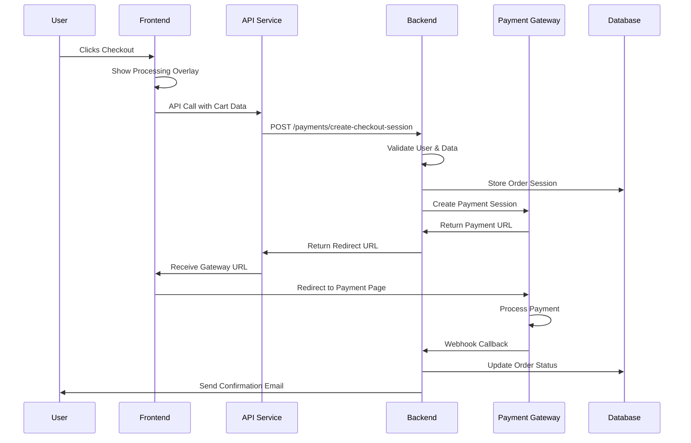
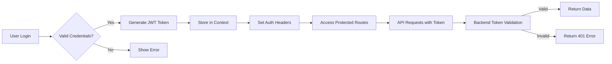
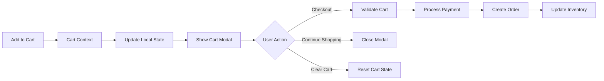
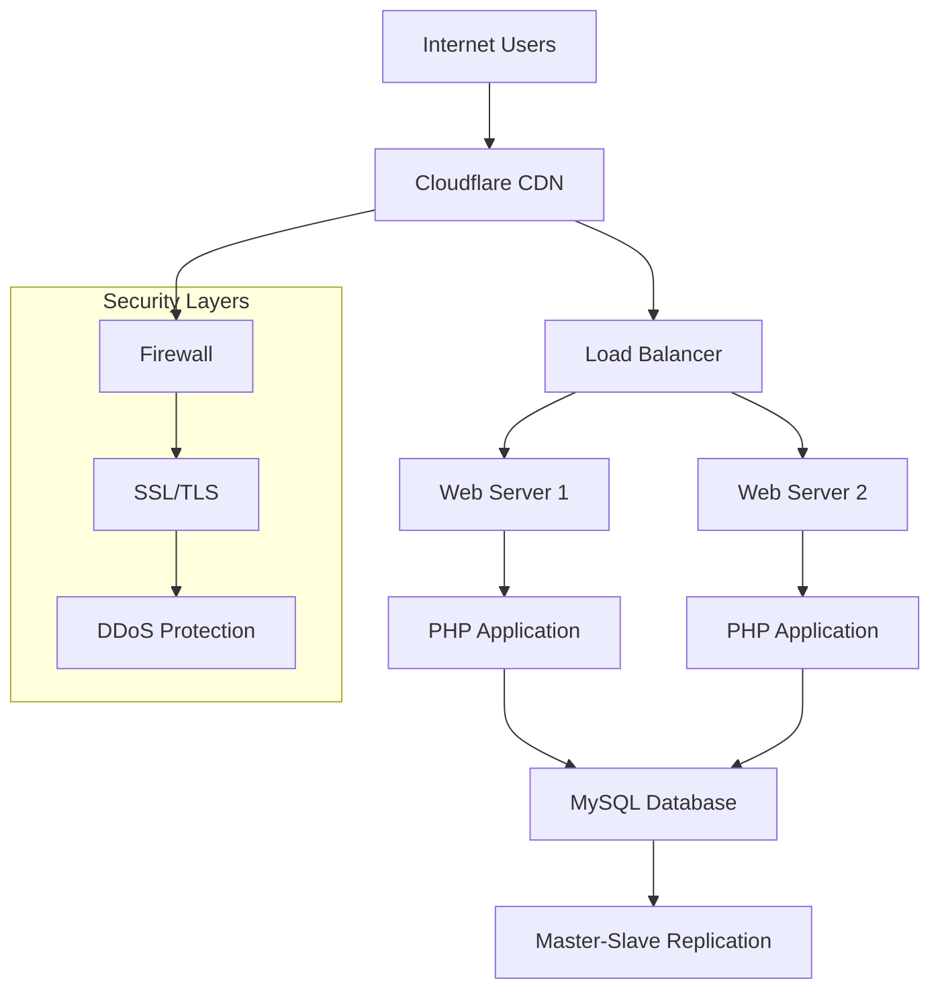
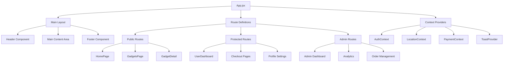
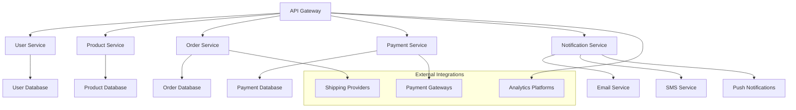
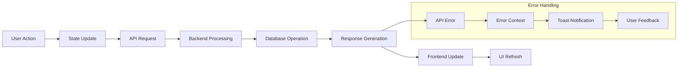
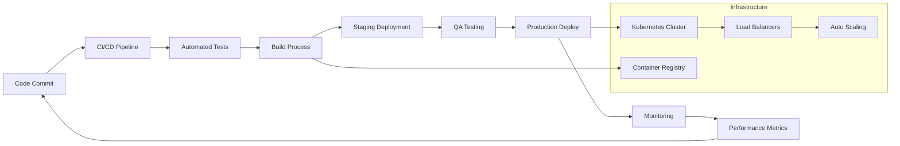

# 📊 Application Architecture Flow Diagrams

## 🔄 Complete End-to-End Flow

```mermaid
graph TD
    A[User Browser] --> B[React Frontend]
    B --> C[Component Interaction]
    C --> D[API Service Layer]
    D --> E[Backend Router]
    E --> F[Business Logic]
    F --> G[Database Layer]
    F --> H[External Services]
    
    G --> I[MySQL Database]
    H --> J[Payment Gateways]
    H --> K[Email/SMS Services]
    H --> L[Analytics Services]
    
    J --> M[Square/PayChangu]
    K --> N[Twilio/SES]
    L --> O[Google Analytics]
    
    I --> P[User Data]
    I --> Q[Order Data]
    I --> R[Product Data]
    
    subgraph "Frontend Components"
        B --> B1[CartModal.jsx]
        B --> B2[CheckoutForm.jsx]
        B --> B3[GadgetDetail.jsx]
        B --> B4[UserDashboard.jsx]
    end
    
    subgraph "Context Providers"
        B --> C1[AuthContext]
        B --> C2[LocationContext]
        B --> C3[PaymentContext]
    end
    
    subgraph "API Endpoints"
        D --> D1[/api/gadgets]
        D --> D2[/api/payments]
        D --> D3[/api/users]
        D --> D4[/api/orders]
    end
```

## 💳 Payment Processing Flow



## 🔐 Authentication Flow



## 🛒 Shopping Cart Flow



## 🌐 Network Infrastructure



## 🏗️ Component Architecture Hierarchy



## 🔧 Microservices Architecture (Future Expansion)



## 📊 Data Flow Patterns



## 🚀 Deployment Pipeline



These diagrams illustrate the complete architecture of your XtraPush application, showing how data flows from user interactions through various layers to backend services and databases, with proper security and scalability considerations.